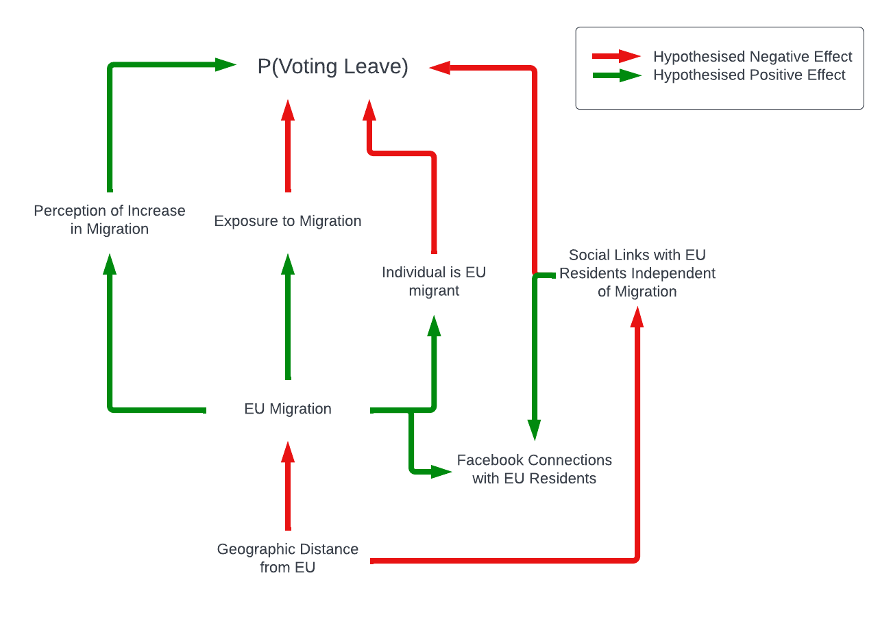

```{r setup, include=FALSE, results= 'hide', message=FALSE}
list.of.packages <- c("tidyverse","ggbiplot","ggplot2", "haven","sf","labelled",
                      "lme4","readxl","margins","corrplot","matrixStats",
                      "stringr","knitr","creditmodel","rticles","stargazer",
                      "ggforce")

new.packages <- list.of.packages[!(list.of.packages %in% installed.packages()[,"Package"])]
if(length(new.packages)) install.packages(new.packages)

library(tidyverse)
library(ggbiplot)
library(ggplot2)
library(haven)
library(sf)
library(labelled)
library(lme4)
library(readxl)
library(matrixStats)
library(stringr)
library(knitr)
library(creditmodel)
library(rticles)
library(daphne)
library(stargazer)
library(ggforce)

options(tinytex.verbose = TRUE)

# Download British Election Study Combined Wave 1-21 Internet Panel here: https://www.britishelectionstudy.com/data-object/british-election-study-combined-wave-1-21-internet-panel/ and save in working directory as "BES.dta"

```

# Introduction

There is a broad literature on the social transmission of social and political values [@huckfeldt1987;@lee2017;@nurmuhammad2016] and the effect of social contact on perceptions of out-groups [@enos2017]. In the digital age, the social connections along which political views might be transmitted can be quantified more easily. This study investigates the effect of transnational social connectedness on voting patterns in the United Kingdom's 2016 Referenfum on membership of the European Union, using Facebook's Social Connectedness Index (SCI) [@sci].

The research question of this study is __Did transnational Facebook connections with individuals in other EU member states reduce the likelihood of voting to leave the EU?__

# Hypotheses

Testable hypotheses are set up to elucidate the research question. These hypotheses are based on theorised relationships between transnational social connections, migration and EU referendum vote choice (Figure \ref{fig:effects}). While the main purpose of this study is to consider the effects of transnational social connections on EU referendum voting, individual-level data on these connections is not available. This means using aggregated data, which is closely related to other variables which may affect voting patterns.

```{r effects, out.width = "100%", echo=FALSE, fig.cap="Hypothesised Effects of Migration and Social Connectedness on EU Referendum Voting"}



```

As illustrated in Figure \ref{fig:effects}, Facebook connections between UK and EU residents are shaped by migration, because it is expected that migrants have high levels of connectedness to origin countries (__H1__).

|        __H1: Areas with higher levels of EU migration tend to have higher levels of social connectedness with EU residents__

The effects of migration on voting operate at both the individual level and as a contextual effect. It is expected that EU migrants are less likely to vote to leave the EU because of the risks to continued freedom of movement. In line with @goodwin2017, it is hypothesised that the presence of EU migrants in an area had a negative effect on the likelihood of voting to leave the EU, both through the individual-level effect and because exposure to migrants reduces anti-migrant sentiment, leading to more positive assessments of membership of the EU (__H2__). Meanwhile, increases in the _rate_ of migration locally had a positive effect on likelihood to vote to leave the EU, because of a perception of undesirable change (__H3__).

|        __H2: The presence of EU migrants in an area has a negative effect on likelihood of voting to leave the EU__

|        __H3: Recent increases in the volume of EU migration in an area has a positive effect on likelihood of voting to leave the EU __

As a result of these migration-related effects, it is expected that areas which voted to remain in the EU will have higher levels of social connectedness with EU residents (__H4__). This is not necessarily a causal relationship, but reflects the fact that areas with higher levels of EU migration tended to vote to remain in the EU.

|       __H4: Areas which voted to remain in the EU tend to have higher levels of social connectedness with EU residents__

Finally, the aim of this study is to isolate the effect of social connectedness with EU residents independent from the individual and contextual effects of migration discussed above. It is hypothesised that social connections will have an independent negative effect on the likelihood of voting to leave the EU, because of the social transmission of positivity towards other EU nations and reduced negativity towards EU migration (__H5__). This is consistent with the findings of @bailey2020, that, across the EU, euroscepticism decreases with the share of a region’s Facebook connections that are to regions in a different European country.

|        __H5: Social connectedness with EU residents has a negative effect on the likelihood of voting to leave the EU__

# Data

## Facebook Social Connectedness Index (SCI)

The SCI is published by Facebook [@sci] to study connections across geographic regions. It is produced by assigning Facebook users to geographic areas using profile information, before counting and scaling the number of connections between pairs of areas. Areas with few friendships are dropped and random noise is added to ensure anonymity. The SCI is the number of possible friendships between two regions which are fulfilled, per billion.

$$Social Connectedness_{i,j} = \frac{FB\_Connections_{i,j}}{FB\_Users_{i}*FB\_Users_{j}}$$

The lowest level in the UK which SCI is measured at is GADM regions, which are concurrent with NUTS regions [@gadm]. Table \ref{table:loadSCI} shows the highest SCI scores including UK regions. As one might expect, the highest scores are within-region, with the highest proportion of friendships fulfilled within UKM66 (Shetland Islands).

```{r loadSCI, echo=FALSE, eval=TRUE}
#links <- read.table(file = 'gadm1_nuts3_counties-gadm1_nuts3_counties-fb-social-connectedness-index-october-2021/gadm1_nuts3_counties_gadm1_nuts3_counties.tsv',
                    #sep = '\t', header = TRUE)

#links <- links[which((startsWith(links$user_loc, "UK"))&(!startsWith(links$user_loc, "UKR"))),]

#write.csv(links, "uk_users.csv")

links <- read.csv("uk_users.csv")

levels <- read.csv("gadm1_nuts3_counties-gadm1_nuts3_counties-fb-social-connectedness-index-october-2021/gadm1_nuts3_counties_levels.csv")

kable(head(links[order(-links$scaled_sci),c("user_loc","fr_loc","scaled_sci")]),
      caption="\\label{table:loadSCI}Highest SCI scores at GADM-level, all pairs including UK regions",
      col.names=c("Region 1","Region 2","SCI"),
      row.names=FALSE)

internal <- links[which(links$user_loc==links$fr_loc),]
```
To study the effect of transnational friendships, SCI scores must be aggregated at higher-levels than GADM1 for regions outside the UK. Because Facebook does not share this information, the closest approximation is a population weighted average. This approach assumes that $Facebook\_Users_{i}$ in the equation above is approximately proportional to the population of region $i$. This is necessary to produce coherent units for analysis. In the EU, GADM1 regions are concurrent with NUTS regions, so NUTS population data can be used [@eurostat].

```{r combine levels, echo=FALSE, warning=FALSE, message=FALSE}

links$fr_level <- levels$level[match(links$fr_loc,levels$key)]

links$fr_level[which(startsWith(links$fr_loc,"AFG"))] <- "gadm1"
links$fr_level[which(startsWith(links$fr_loc,"MUS"))] <- "gadm1"
links$fr_level[which(is.na(links$fr_level))] <- "country"

#Load NUTS populations

nuts_populations <- read.csv("demo_r_pjanaggr3_1_Data.csv")
nuts_populations$geo_year <- paste(nuts_populations$GEO, nuts_populations$TIME)

#Find the earliest year (2016 or later) with valid population data for NUTS regions

minimum_year <- nuts_populations %>%
  dplyr::group_by(GEO) %>%
  dplyr::summarise(min = min(TIME[which(Value!=":")]))

#Create geo-year keys to merge

minimum_year$geo_year <- paste(minimum_year$GEO, minimum_year$min)

nuts_populations$include <- 0
nuts_populations$include[match(minimum_year$geo_year,nuts_populations$geo_year)] <- 1
nuts_populations$Value <- as.numeric(gsub(",", "", nuts_populations$Value))
pops <- nuts_populations[which(nuts_populations$include==1),]

links$weight <- 1

indexes <- match(links$fr_loc,pops$GEO)[which(!is.na(match(links$fr_loc,pops$GEO)))]

links$weight[which(!is.na(match(links$fr_loc,pops$GEO)))] <- pops$Value[indexes]

links$fr_country <- sapply(strsplit(links$fr_loc, split = "(?<=[a-zA-Z])\\s*(?=[0-9])", perl = TRUE), `[`, 1)

france <- c("FRY","FRM","FRL","FRK","FRJ","FRI","FRH","FRG","FRF","FRE","FRD","FRC","FRB")

links$fr_country[which(links$fr_country %in% france)] <- "FR"

germany <- c("DE","DEA","DEB","DEC","DED","DEE","DEF","DEG")

links$fr_country[which(links$fr_country %in% germany)] <- "DE"

italy <- c("ITC","ITF","ITG","ITH","ITI")

links$fr_country[which(links$fr_country %in% italy)] <- "IT"

turkey <- c("TR","TRA","TRB","TRC")

links$fr_country[which(links$fr_country %in% turkey)] <- "TR"

united_kingdom <- c("UKC","UKD","UKE","UKF","UKG","UKH","UKI","UKJ","UKK","UKL",
                    "UKM","UKN")

links$fr_country[which(links$fr_country %in% united_kingdom)] <- "UK"

countries <- links %>%
  dplyr::group_by(user_loc,fr_country) %>%
  dplyr::summarise(mean = mean(scaled_sci),
                   weighted_mean = weighted.mean(scaled_sci,weight))

countries_fromuk <- countries[which((startsWith(countries$user_loc, "UK"))&
                                      (!startsWith(countries$user_loc, "UKR"))&
                                      (!startsWith(countries$fr_country, "UK"))),]

kable(head(countries_fromuk[order(-countries_fromuk$weighted_mean),]),
      caption="\\label{table:countrySCI}Highest SCI scores between UK regions and other countries",
      col.names=c("UK Region","Country","Mean SCI","Population Weighted Mean SCI"),
      row.names=FALSE,
      digits=0)

```

Table \ref{table:countrySCI} shows UK NUTS regions and their scaled SCI with countries excluding the UK. The most connected regions are UKN11 (Mid Ulster) and TLS (East Timor). An article by The Belfast Telegraph [@belfast_telegraph] suggests that there is a genuine connection, however, the presence of Timor-Leste also shows the limitations of the SCI. The SCI measures the proportion of all possible connections fulfilled, rather than the proportion of residents. In the East Timorese case, it may be that a small minority of Mid Ulster residents have many East Timorese connections, rather than a large proportion of those in Mid Ulster having a connection to East Timor.

Principal components analysis (PCA) can be used for discriptive analysis, showing some of the associations between UK regions and country-level SCI scores. A log transformation is used to scale the data, to reflect the exponential nature of social connections [@bettencourt2007]. The results (Figure \ref{fig:biplot}) show how there is significant correlation between countries along one scale (PC1). Areas with more transnational connections tend to have higher SCI scores across the board (with the sole exception of the Isle of Man). PC2 explains much less variation, only 6.4%.

```{r biplot, echo=FALSE, out.width = "80%", fig.cap="Biplot of country-level SCI scores by UK NUTs area",fig.align="center"}

df <- data.frame(user_loc = unique(countries_fromuk$user_loc))

for (country in unique(countries_fromuk$fr_country)){
  df[country] <- NA
  for (region in unique(countries_fromuk$user_loc)){
    df[which(df$user_loc==region),country] = log(countries_fromuk[which((countries_fromuk$user_loc==region)&(countries_fromuk$fr_country==country)),"weighted_mean"][[1]])
  }
}

df.pca <- prcomp(df[,c(2:200)], center = TRUE,scale. = FALSE)

biplot <- ggbiplot(df.pca, labels=df$user_loc,
        labels.size = 1,varname.size = 1,
        var.scale=1, var.size=1,varname.adjust=10, width=0.1) +
  theme_minimal() +
  theme(axis.text=element_text(size=6),
        axis.title=element_text(size=6))

biplot[["layers"]][[1]][["aes_params"]][["size"]] <- 0.1
biplot[["layers"]][[1]][["geom_params"]][["arrow"]][["length"]] <- ggplot2::unit(0.1, "picas")

biplot

```
Finally, EU-27 country-level SCI scores are merged using a population weighted average to give each NUTS-3 region of the UK an SCI score for the EU-27. This statistic is plotted in Figure \ref{fig:sci_map} along with internal SCI. That is, the proportion of social connections within the region which are fulfilled. The two indexes are compared in Figure \ref{fig:scatter}.

```{r eu members,echo=FALSE, out.width = "49%", fig.show='hold', fig.cap="\\label{fig:sci_map}NUTS3 Regions by SCI with the EU-27 and interally",fig.align="center"}

eu_members <- c("AT","BE","BG","HR","CY","DK","EE","FI","FR","DE","EL","HU","IE","IT",
        "LV","LT","LU","MT","NL","PL","PT","RO","SK","SV","ES","SE")

links$eu <- 0
links$eu[which(links$fr_country %in% eu_members)] <- 1

eu_links <- links[which(links$eu==1),] %>%
  dplyr::group_by(user_loc) %>%
  dplyr::summarise(mean = mean(scaled_sci),
                   weighted_mean = weighted.mean(scaled_sci,weight))

map <- read_sf("NUTS_Level_3_(January_2018)_Boundaries (1)")

map$eu_links <- eu_links$weighted_mean[match(eu_links$user_loc, map$nuts318cd)]

ggplot(data=map, aes(fill=eu_links)) +
  geom_sf(size=0) +
  scale_fill_gradient(trans="log",low="black", high="green") +
  labs(fill="Social \nConnectedness \nwith the EU27\n(log)\n") +
  theme_minimal()

map$internal_links <- internal$scaled_sci[match(internal$user_loc, map$nuts318cd)]

ggplot(data=map, aes(fill=internal_links)) +
  geom_sf(size=0) +
  scale_fill_gradient(trans="log",low="black", high="green") +
  labs(fill="Internal \nConnectedness \n(log)\n") +
  theme_minimal()

```

```{r scatter, echo=FALSE, out.width="80%", fig.cap="\\label{fig:scatter}Scatter Plot of Internal and EU-27 SCI Scores",fig.align="center"}

ggplot(data=map, aes(x=eu_links, y=internal_links)) +
  geom_point() +
  scale_x_continuous(trans="log10",breaks=c(200,400,800,1600)) +
  scale_y_continuous(trans="log10",breaks=c(100000,1000000,10000000,100000000)) +
  geom_point(map[which(map$nuts318cd=="UKI31"),],mapping=aes(x=eu_links, y=internal_links),
             shape=1, col="blue",size=4) +
  geom_text(map[which(map$nuts318cd=="UKI31"),],
            mapping=aes(x=eu_links,
                        y=internal_links+35000,label="Camden and City of London"),
            col="black",size=4) +
  geom_text(map[which(map$nuts318cd=="UKM66"),],
            mapping=aes(x=eu_links+110,
                        y=internal_links-22000000,label="Orkney,\nShetland and\nWestern Isles"),
            col="black",size=4) +
  geom_shape(data.frame(x=c(150,150,255,255),
                          y=c(34082660,73610896,73610896,34082660)),
               mapping=aes(x=x,y=y), radius=unit(0.1, 'cm'),
             fill="#00000000",col="blue") +
  geom_point(map[which(map$nuts318cd=="UKI32"),],mapping=aes(x=eu_links, y=internal_links),
             shape=1, col="blue",size=4) +
  geom_text(map[which(map$nuts318cd=="UKI32"),],
            mapping=aes(x=eu_links-200,
                        y=internal_links-90000,label="Westminster"),
            col="black",size=4) +
  labs(x="EU-27 SCI (log scale)",y="Internal SCI (log scale)") +
  theme_minimal()
  

```

## British Election Study

The second main source of data is the British Election Study (BES) [@bes]. The BES is a large-scale survey of public opinion, with data available at the level of individual respondents. There are wide ranging questions including demographic variables, policy preferences and past votes. BES is conducted using online surveys and a random sample weighted to be representative of the population of Great Britain. Wave 9, which includes the most relevant data for this study, was conducted between 24th June 2016 and 4th July 2016 with 30,036 respondents.

To check the validity of BES, NUTS-level samples are compared to true EU Referendum results @results. Figure \ref{fig:bes_validity} shows how 76% of NUTS regions have sample proportions within the 95% margin of error of true EU Referendum results for the sample size. This suggests some sampling bias on top of statistical variance.

``` {r bes_validity, echo=FALSE,out.width = "80%", fig.cap="Reported EU Referendum vote (BES) compared with true results at NUTs-level", warning=FALSE, message=FALSE, eval=TRUE, fig.align="center"}

la_lookup <- read.csv("Local_Authority_District_(December_2018)_to_NUTS3_to_NUTS2_to_NUTS1_(January_2018)_Lookup_in_United_Kingdom.csv")

bes <- read_dta("BES.dta")

bes <- bes[which(bes$wave9==1),]

irrelevant_waves <- c("W1","W2","W3","W4","W5","W6","W7","W8","W10","W11",
                      "W12","W13","W14","W15","W16","W17","W18","W19","W20","W21")

current <- endsWith(colnames(bes),"W1")

for (wave in irrelevant_waves){
  new <- endsWith(colnames(bes),wave)
  current <- rowAny(cbind(current,new))
}

bes <- bes[,!current]

bes$localauthority <- to_character(bes$oslauaW9)

bes$localauthority[which(bes$localauthority=="Argyll & Bute")] <- "Argyll and Bute"
bes$localauthority[which(bes$localauthority=="Armagh, Banbridge and Craigavon")] <- "Armagh City, Banbridge and Craigavon"
bes$localauthority[which(bes$localauthority=="Dumfries & Galloway")] <- "Dumfries and Galloway"
bes$localauthority[which(bes$localauthority=="Edinburgh, City of")] <- "City of Edinburgh"
bes$localauthority[which(bes$localauthority=="Eilean Siar")] <- "Na h-Eileanan Siar"
bes$localauthority[which(bes$localauthority=="North Down and Ards")] <- "Ards and North Down"
bes$localauthority[which(bes$localauthority=="Perth & Kinross")] <- "Perth and Kinross"
bes$localauthority[which(bes$localauthority=="Rhondda, Cynon, Taff")] <- "Rhondda Cynon Taf"
bes$localauthority[which(bes$localauthority=="Shepway")] <- "Folkestone and Hythe"
bes$localauthority[which(bes$localauthority=="The Vale of Glamorgan")] <- "Vale of Glamorgan"

bes$nuts3 <- la_lookup$NUTS318CD[match(bes$localauthority,la_lookup$LAD18NM)]

bes$eu_links <- eu_links$weighted_mean[match(bes$nuts3,eu_links$user_loc)]
bes$internal_links <- internal$scaled_sci[match(bes$nuts3,internal$user_loc)]
bes$distance <- map$distance[match(bes$nuts3,map$nuts318cd)]

bes$voted_leave <- NA
bes$voted_leave[which(bes$euRefVoteW9==0)] <- 0
bes$voted_leave[which(bes$euRefVoteW9==1)] <- 1

nuts_euref <- bes %>%
  dplyr::group_by(nuts3) %>%
  dplyr::summarise(bes = weighted.mean(voted_leave, wt_new_W9,na.rm=TRUE),
                   count = n())

source("scripts/nuts_data.R", local = knitr::knit_global())

variables <- colnames(nuts3_data)[5:8]

bes[,variables] <- nuts3_data[match(bes$nuts3, nuts3_data$nuts3),variables]

nuts_euref$true <- nuts3_data$pct_leave[match(nuts_euref$nuts3,nuts3_data$nuts3)]

nuts_euref$difference <- nuts_euref$bes - nuts_euref$true

nuts_euref$moe <- 1.96*sqrt(nuts_euref$bes*(1-nuts_euref$bes)/nuts_euref$count)

ggplot(data=nuts_euref, aes(x=true, y=bes)) +
  geom_point() +
  geom_abline(intercept=0, slope=1, col="red",lty=2) +
  geom_errorbar(data=nuts_euref, aes(x=true, ymin=bes-moe, ymax=bes+moe), alpha=0.3) +
  labs(x="True EU Referendum Result",y="BES Sample Proportion Voting Leave") +
  scale_x_continuous(limits=c(0,1.05)) +
  scale_y_continuous(limits=c(0,1.05))

```

## NUTS-3 Level Data

Migration data is aggregated at the NUTS-level, using datasets provided at local authority level by the Office for National Statistics [@ons_migration,@ons_cob]. This includes the proportion of residents born in the EU, the rate of EU migration as a proportion of current population in 2016, and change in rate of EU migration between 2011 and 2016. Finally, distances between NUTS regions and the EU-27 are calculated. These distances are measured from the centroid of each NUTS regions to the closest border of the EU-27 (Figure \ref{fig:distances}).

``` {r distances,echo=FALSE, out.width = "50%",fig.cap="Distance to EU-27", warning=FALSE, fig.align="center"}

europe <- read_sf("NUTS_RG_60M_2016_4326_LEVL_3.shp")

uk <- europe[which(europe$CNTR_CODE=="UK"),]
nonuk <- europe[which(europe$CNTR_CODE!="UK"),]

index <- st_nearest_feature(x = uk, y = nonuk)

nearest <- nonuk %>% slice(index)

distances <- st_distance(x = st_centroid(uk), y= nearest, by_element = TRUE)

map$distance <- distances[match(map$nuts318cd,uk$NUTS_ID)]

ggplot(data=map, aes(fill=as.numeric(distance))) +
  geom_sf(size=0) +
  scale_fill_gradient(low="black", high="green") +
  theme_minimal() +
  labs(fill="Distance\nfrom the EU (m)")

```

# Methods

The primary method used is multilevel logistic regression [@gelmanhill2007]. The dependent variable is self-reported vote to leave the EU, of all those who voted in the 2016 Referendum, weighted using BES weights. A multilevel model better represents the hierarchical nature of survey data, with respondents nested within geographic or demographic groups. In each case, respondents are drawn from broader populations and the effect of these group-memberships is drawn from a distribution of possible effects. In practice, this is useful because it allows for partial pooling of the intercept and variance of each group, leading to more accurate estimates including more robust standard errors for fixed effects. In this study, we are most interested in the effect of migration and social connections, so most other variables are included as random effects.

# Results

The first results to consider are of two correlation tests, between SCI scores and the proportion of people born in the EU-27 (__H1__) and between SCI scores and the proportion of people who voted to leave the EU (__H4__) at NUTS level. In both cases, there is a significant correlation, leading us to accept the hypotheses. The correlation between SCI and EU-born population is particularly high (0.899) while the correlation between SCI and leave-voting is less pronounced but significant (-0.463).

\begin{table}[!htbp] \centering 
  \caption{Correlation Tests} 
  \label{table:cor} 
\begin{tabular}{@{\extracolsep{5pt}}lcc} 
\\[-1.8ex]\hline 
\hline \\[-1.8ex] 
\\[-1.8ex] & \multicolumn{2}{c}{Pearson's Product-Moment Correlation} \\ 
\\[-1.8ex] & \multicolumn{2}{c}{EU-27 Social Connectedness Index} \\ 
  & &  \\ 
\\[-1.8ex] & Percentage Born in EU & Leave Vote Percentage \\ 
\hline \\[-1.8ex] 
  & &  \\ 
 Estimate & 0.899$^{***}$ & -0.463$^{***}$ \\ 
  & &  \\ 
 Degrees of Freedom & 165 & 166 \\ 
 T-Statistic & 26.421 & -6.739 \\
 95\% Confidence Interval & [0.866, 0.925] & [-0.575, -0.336] \\
  & &  \\ 
\hline 
\hline \\[-1.8ex] 
\textit{Note:}  & \multicolumn{2}{r}{$.$ p$<$0.1; $^{*}$p$<$0.05; $^{**}$p$<$0.01; $^{***}$p$<$0.001} \\ 
\end{tabular} 
\end{table}

``` {r cob eu_links, echo=FALSE,eval=FALSE}

nuts3_data$eu_links <- eu_links$weighted_mean[match(nuts3_data$nuts3, eu_links$user_loc)]

cor.test(nuts3_data$eu_cob_pct,nuts3_data$eu_links)

cor.test(nuts3_data$pct_leave,nuts3_data$eu_links)

```


To consider __H2__, __H3__ and __H5__, the results of multilevel logistic regression is presented in Table \ref{table:regression}.

In line with __H2__ and __H3__, the rate of EU migration has a negative effect on the likelihood of voting to leave the EU, while a change in rate has a positive effect. However, these effects are not significant in models 5 or 6, so there is insufficient evidence to accept the hypotheses. In addition, rather than the expected negative relationship between SCI and voting to leave (__H5__), there is a small positive effect, which is not significant. This is the case across all six models. Again, there is insufficient evidence to accept the hypothesis. Perhaps the most interesting finding is that in both models 3 and 6, the internal SCI of a region has a significant positive effect.

```{r model, echo=FALSE, warning=FALSE, eval=FALSE}

bes$distance <- distances[match(bes$nuts3,uk$NUTS_ID)]

model1 <- glmer(voted_leave ~ rescale(as.numeric(ageW9),to=c(0,1)) + 
                         gender + (1|nuts3) +
                         inflow16_pct + inflow_change + log(eu_links) + log(internal_links) +
                         rescale(as.numeric(distance), to=c(0,1)),
               data=bes, weight=wt_new_W9, family="binomial")

model2 <- glmer(voted_leave ~ rescale(as.numeric(ageW9),to=c(0,1)) + 
                         (1|p_edlevelW9) + (1|p_ethnicityW9) + gender +
                         (1|p_country_birthW9) + (1|p_gross_personalW9) +
                         (1|p_gross_householdW9) + (1|p_socgradeW9) +
                         (1|p_paper_readW9) +
                         (1|gorW9) + (1|nuts3) +
                         log(eu_links),
               data=bes, weight=wt_new_W9, family="binomial")

model3 <- glmer(voted_leave ~ rescale(as.numeric(ageW9),to=c(0,1)) + 
                         (1|p_edlevelW9) + (1|p_ethnicityW9) + gender +
                         (1|p_country_birthW9) + (1|p_gross_personalW9) +
                         (1|p_gross_householdW9) + (1|p_socgradeW9) +
                         (1|p_paper_readW9) +
                         (1|gorW9) + (1|nuts3) +
                         log(internal_links),
               data=bes, weight=wt_new_W9, family="binomial")

model4 <- glmer(voted_leave ~ rescale(as.numeric(ageW9),to=c(0,1)) + 
                         (1|p_edlevelW9) + (1|p_ethnicityW9) + gender +
                         (1|p_country_birthW9) + (1|p_gross_personalW9) +
                         (1|p_gross_householdW9) + (1|p_socgradeW9) +
                         (1|p_paper_readW9) +
                         (1|gorW9) + (1|nuts3) +
                         inflow16_pct + inflow_change,
               data=bes, weight=wt_new_W9, family="binomial")

model5 <- glmer(voted_leave ~ rescale(as.numeric(ageW9),to=c(0,1)) + 
                         (1|p_edlevelW9) + (1|p_ethnicityW9) + gender +
                         (1|p_country_birthW9) + (1|p_gross_personalW9) +
                         (1|p_gross_householdW9) + (1|p_socgradeW9) +
                         (1|p_paper_readW9) +
                         (1|gorW9) + (1|nuts3) +
                         inflow16_pct + inflow_change + log(eu_links),
               data=bes, weight=wt_new_W9, family="binomial")

model6 <- glmer(voted_leave ~ rescale(as.numeric(ageW9),to=c(0,1)) + 
                         (1|p_edlevelW9) + (1|p_ethnicityW9) + gender +
                         (1|p_country_birthW9) + (1|p_gross_personalW9) +
                         (1|p_gross_householdW9) + (1|p_socgradeW9) +
                         (1|p_paper_readW9) +
                         (1|gorW9) + (1|nuts3) +
                         inflow16_pct + inflow_change + log(eu_links) + log(internal_links) +
                         rescale(as.numeric(distance), to=c(0,1)),
               data=bes, weight=wt_new_W9, family="binomial")

stargazer(model1,
          model2,
          model3,
          model4,
          model5,
          model6)

```

\begin{table}[!htbp] \centering 
  \caption{Logistic Regression Models} 
  \label{table:regression} 
\begin{tabular}{@{\extracolsep{5pt}}lcccccc} 
\\[-1.8ex]\hline 
\hline \\[-1.8ex] 
 & \multicolumn{6}{c}{\textit{Dependent variable:}} \\ 
\cline{2-7} 
\\[-1.8ex] & \multicolumn{6}{c}{Leave Vote} \\ 
\\[-1.8ex] & (1) & (2) & (3) & (4) & (5) & (6)\\ 
\hline \\[-1.8ex] 
 Age (Scaled 0-1) & 1.789$^{***}$ & 1.156$^{***}$ & 1.146$^{***}$ & 1.150$^{***}$ & 1.150$^{***}$ & 1.145$^{***}$ \\ 
  & (0.059) & (0.081) & (0.081) & (0.081) & (0.081) & (0.074) \\ 
  & & & & & & \\ 
 Gender (Female = 1) & $-$0.087$^{**}$ & $-$0.149$^{***}$ & $-$0.150$^{***}$ & $-$0.149$^{***}$ & $-$0.149$^{***}$ & $-$0.149$^{***}$ \\ 
  & (0.029) & (0.036) & (0.036) & (0.036) & (0.036) & (0.033) \\ 
  & & & & & & \\ 
 EU Migration Inflow & $-$16.229$^{*}$ &  &  & $-$4.769 & $-$11.670 & $-$7.773 \\ 
 2016 (Per Capita) & (6.713) &  &  & (3.942) & (7.100) & (6.433) \\ 
  & & & & & & \\ 
 Inflow Change & 61.489$^{***}$ &  &  & 26.790$^{**}$ & 20.338$^{.}$ & 13.968 \\ 
 2011-2016 & (10.504) &  &  & (9.525) & (11.474) & (16.809) \\ 
  & & & & & & \\ 
 log( EU-27 SCI ) & 0.148 & 0.021 &  &  & 0.161 & 0.204$^{.}$ \\ 
  & (0.100) & (0.080) &  &  & (0.118) & (0.111) \\ 
  & & & & & & \\ 
 log( Internal SCI ) & 0.055 &  & 0.165$^{**}$ &  &  & 0.164$^{**}$ \\ 
  & (0.052) &  & (0.053) &  &  & (0.054) \\ 
  & & & & & & \\ 
 Distance from EU & 0.210 &  &  &  &  & 0.321 \\ 
 (Scaled 0-1) & (0.207) &  &  &  &  & (0.299) \\ 
  & & & & & & \\ 
 Constant & $-$2.247$^{*}$ & $-$1.008$^{.}$ & $-$3.230$^{***}$ & $-$0.835$^{*}$ & $-$1.713$^{*}$ & $-$4.478$^{***}$ \\ 
  & (1.085) & (0.580) & (0.833) & (0.341) & (0.730) & (1.130) \\ 
  & & & & & & \\ 
\hline \\[-1.8ex] 
\\[-1.8ex] & \multicolumn{6}{c}{Random Effects $\sigma^2$} \\ 
  & & & & & & \\
NUTS 3 & 0.106 & 0.092 & 0.077 & 0.087 & 0.087 & 0.074 \\
Gross Household Income & & 0.010 & 0.010 & 0.010 & 0.010 & 0.010 \\
Gross Personal Income & & 0.583 & 0.580 & 0.582 & 0.582 & 0.581 \\
Newspaper Read & & 0.009 & 0.009 & 0.009 & 0.009 & 0.009 \\
Ethnicity & & 0.223 & 0.224 & 0.224 & 0.225 & 0.226 \\
County of Birth & & 0.019 & 0.019 & 0.019 & 0.019 & 0.019 \\
UK Region & & 0.050 & 0.083 & 0.051 & 0.045 & 0.066 \\
Social Grade & & 0.079 & 0.079 & 0.079 & 0.079 & 0.079 \\
Education Level & & 0.188 & 0.189 & 0.187 & 0.187 & 0.187 \\
  & & & & & & \\ 
\hline \\[-1.8ex] 
Observations & 28,195 & 22,803 & 22,803 & 22,803 & 22,803 & 22,803 \\ 
Log Likelihood & $-$14,277 & $-$10,362 & $-$10,357 & $-$10,360 & $-$10,359 & $-$10,355 \\ 
Akaike Inf. Crit. & 28,571 & 20,750 & 20,741 & 20,748 & 20,748 & 20,743 \\ 
Bayesian Inf. Crit. & 28,645 & 20,855 & 20,845 & 20,860 & 20,869 & 20,880 \\ 
\hline 
\hline \\[-1.8ex] 
\textit{Note:}  & \multicolumn{6}{r}{$.$ p$<$0.1; $^{*}$p$<$0.05; $^{**}$p$<$0.01; $^{***}$p$<$0.001} \\ 
\end{tabular} 
\end{table} 

# Discussion and Conclusion

This study has not provided conclusive evidence of an effect of transnational social connectedness on voting choices in the 2016 EU Referendum. This may be due to the aggregation of SCI scores, measurement error, confounding variables, or simply that the theorised effect does not occur. One interesting result, which ought to be studied further, is the significant positive relationship between voting to leave the EU and internal SCI. Internal SCI shows connectedness within regions, and tends to be highest in areas which are relatively isolated (especially island regions). This may reflect suspicion of migration and/or transnational institutions in tightly knit communities, or a particular form of social transmission of euroscepticism. Internal SCI is also likely to be closely correlated to areas with fewer links to other areas of the UK, which may be related to narratives of regional inequality and "geography of discontent" [@mccann2021].

# Replication Materials {-}

Winter, O. (2022) Facebook Links Project. GitHub Repository. [https://github.com/owenwntr/facebook_links_project](https://github.com/owenwntr/facebook_links_project)

# R Packages {-}

* creditmodel [@creditmodel]
* ggbiplot [@ggbiplot]
* ggforce [@ggforce]
* ggplot2 [@ggplot2]
* haven [@haven]
* knitr [@knitr]
* labelled [@labelled]
* lme4 [@lme4]
* matrixStats [@matrixStats]
* readxl [@readxl]
* rticles [@rticles]
* sf [@sf]
* stargazer [@stargazer]
* stringr [@stringr]
* tidyverse [@tidyverse]

# Bibliography

  
  

  
  
  

